Menggunakan taq pada javascript
```HTML
<HTML>
  ```
= Menandakan bahwa isi file ini adalah dokumen HTML.
```HTML
<HEAD><TITLE> contoh JavaScript</TITLE> 

= berfungsi untuk memberikan judul halaman web.
<script language="JavaScript"> 
document.write("Program JavaSript Aku di kepala"); 
= Menempatkan document.write di dalam elemen <head> akan langsung menulis teks ke dokumen saat halaman dimuat.
</script> 
</HEAD> 
<BODY> 
<script language="JavaScript"> 
document.write("Program JavaSript Aku di body"); 
= Posisi: Di dalam elemen <body>.
Fungsi: Menulis langsung teks "Program JavaSript Aku di body" ke dalam dokumen HTML saat halaman dimuat.
Efek: Karena ini ada di dalam <body>, teks yang ditulis akan muncul sebagai bagian konten halaman yang terlihat oleh pengguna.
</script> 
= Menandai akhir dari blok kode JavaScript yang sebelumnya dibuka dengan
</BODY>
= Menutup elemen <body>, yang merupakan bagian utama dari halaman HTML
</HTML> 
= Menutup elemen <html>, yang merupakan root dari dokumen HTML.

Menggunkan Event pada javascript

<!DOCTYPE html> 
<html> 
<head> 
 <title>Belajar Javascript : Mengenal Event Pada Javascript</title> </head> 
 = Bagian metadata dari dokumen, berisi judul halaman yang muncul di tab browser.

<body> 
= Bagian utama halaman web tempat konten yang akan ditampilkan ke pengguna ditulis.

 	<h1>Mengenal Event Pada Javascript</h1> 
 	<h2> Perograman WEB Event one click</h2> 
= Heading utama dan subjudul yang menjelaskan topik halaman.
  	
 	<button onclick="tampilkan_nama()">klik disini </button> 
= Tombol yang jika diklik akan menjalankan fungsi JavaScript bernama tampilkan_nama().
  
 	<div id="hasil"></div> 
 	<script>  	 
"<h3>Nama Saya Adalah Andi Akram Nur Risal</h3>"; 
= Tombol yang jika diklik akan menjalankan fungsi JavaScript bernama tampilkan_nama().
 	 	
</script> 
</body> 
</html> 

Contoh sederhana pada javaScript

<HTML> 
= Menandakan awal dari dokumen HTML.

<HEAD><TITLE> contoh sederhana JavaScript</TITLE></HEAD> 
= Tempat metadata halaman HTML, seperti title,Teks yang ditampilkan pada tab browser, di sini: "contoh sederhana JavaScript".
<BODY> 
= Bagian utama halaman web tempat konten 

<script language="JavaScript"> 
= ini adalah tag untuk menuliskan kode JavaScript.

document.write("Selamat Belajar Angkatan 2019","<br>"); 
= Menulis teks "Selamat Belajar Angkatan 2019" ke dalam halaman HTML saat halaman dimuat.

document.write("JavaScript Pemrograman WEB Teknik Komputer"); </script> 
= Menulis teks lanjutan di baris berikutnya: "JavaScript Pemrograman WEB Teknik Komputer"

</BODY> 
</HTML>

MEMASUKAN DATA PADA JAVASCRIPT

<HTML> 
= Menandakan awal dari dokumen HTML.
<HEAD> 
= berisi metadata dan informasi tentang halaman.

<TITLE>Masukan Data</TITLE> 
= Menentukan judul halaman web yang akan ditampilkan di tab browser atau jendela browser.

</HEAD> 
<BODY> 
<SCRIPT LANGUAGE = "JavaScript"> 
= Menandakan bahwa ini adalah blok kode JavaScript.
<!-- 
   var nama = prompt("Siapa nama Anda?");    document.write("Hai, " + nama); 
= Dulu digunakan untuk menyembunyikan script dari browser lama yang belum mendukung JavaScript.
</SCRIPT> 
</BODY> 
</HTML>

JENDELA PERINGATAN DAN KONFIRMASI CONTOH 1

<!DOCTYPE html>
= Menyatakan bahwa dokumen ini adalah HTML5.

<html>
= Elemen utama yang membungkus seluruh isi dokumen HTML.
<head>
= Berisi informasi tentang halaman 
  <title>Alert Box</title>
  = Tempat konten utama halaman seperti teks, gambar, tombol, dan juga skrip.

</head>
<body>
  <script type="text/javascript">
= Membuka blok JavaScript di dalam HTML.
    window.alert("Apakah anda akan meninggalkan laman ini ?");
= Menampilkan kotak peringatan (alert box) ke pengguna.

  </script>
= Menutup blok JavaScript.
</body>
= Menutup bagian isi halaman.
</html>
= Menutup bagian isi halaman.

JENDELA PERINGATAN DAN KONFIRMASI CONTOH 2

<HTML> 
= Elemen utama yang membungkus seluruh isi dokumen HTML.

<HEAD> 
<TITLE>Konfirmasi</TITLE> 
= Judul halaman yang akan tampil di tab browser. Di sini, judulnya adalah "Konfirmasi".

</HEAD> 
<BODY> 
= Bagian utama dari halaman yang akan ditampilkan ke pengguna.
<SCRIPT LANGUAGE = "JavaScript"> 
= Menyisipkan JavaScript. Meskipun atribut LANGUAGE sudah usang (deprecated), secara historis digunakan untuk menunjukkan bahasa scripting.
   var jawaban = window.confirm( 
"Apakah anda sudah yakin ?");    document.write("Jawaban Anda: " + jawaban); 
= menampilkan kotak dialog konfirmasi dengan pesan "Apakah anda sudah yakin?" dan dua tombol: OK dan Cancel.

</SCRIPT> 
</BODY> 
</HTML> 

MENDEKLARISAKN VARIABEL

<script language="Javascript">  
= Menandai bahwa isi di dalamnya adalah kode JavaScript.
<!--  

var VariabelKu;
= Mendeklarasikan variabel bernama VariabelKu tapi belum diberi nilai (nilainya undefined saat ini).

var VariabelKu2 = 3;
= Mendeklarasikan variabel VariabelKu2 dan langsung mengisinya dengan nilai 3.
 
 VariabelKu = 1234;
 = Memberikan nilai 1234 ke variabel VariabelKu yang sebelumnya dideklarasikan.  

document.write(VariabelKu*VariabelKu2);  
= Menampilkan hasil perkalian dari VariabelKu dan VariabelKu2 ke halaman HTML.
Perhitungannya: 1234 * 3 = 3702 

</script> 

GLOBAL DAN LOKAL VARIABEL 1

<html>
= Tag utama pembungkus seluruh dokumen HTML.

<head>
= Bagian yang berisi metadata, seperti 
<title>

<title>Global dan lokal</title>
= Memberi judul halaman yang tampil di tab browser Sesuai dan benar.

<body>
= empat konten yang akan ditampilkan di halaman web.

<script language= "Javascript" >
  = Tempat menulis kode JavaScript yang berjalan saat halaman dimuat.
 <!--
var a= 12;
 var b= 4;
 = Mendeklarasikan dua variabel global a dan b dengan nilai 12 dan 4. Sesuai, variabel global.

function Perkalian_Dengan2(b){
 a=b*2;
return a;}
= Menerima parameter b (yang lokal dalam fungsi).
Mengubah variabel global a menjadi b * 2.
Mengembalikan nilai a.


document.write("dua kali dari ",b," adalah ",Perkalian_Dengan2(b));

=  hanya menerima satu argumen string.
Penggunaan beberapa argumen seperti ini akan menimbulkan error atau tidak tampil dengan benar.

document.write(" nilai dari a adalah ", a);
= Menampilkan nilai variabel a setelah fungsi dijalankan.
   -->
</script>
</body>
  </head>
</html>

GLOBAL DAN LOKAL VARIABEL 2

!DOCTYPE html>
= Mendefinisikan tipe dokumen sebagai HTML5.
Penting agar browser memproses dokumen dengan standar HTML5.
<html>
= Tag pembuka dan penutup dari seluruh dokumen HTML
<head>
  <title>Perkalian dan Nilai a</title>
</head>
= Bagian metadata halaman.
<title> memberikan judul halaman yang muncul di tab browser.
Di sini, judulnya adalah "Perkalian dan Nilai a".

<body>
= Bagian konten utama halaman yang tampil ke pengguna.

<script type="text/javascript">
 = Menyisipkan kode JavaScript ke dalam halaman.

  var a = 12;
  var b = 4;
  = Mendeklarasikan dua variabel global a dan b.
a diset ke 12, b diset ke 4.

  function PerkalianDengan2(x) {
    return x * 2;
  }
= Fungsi ini menerima satu parameter x.
Mengembalikan hasil perkalian x dengan 2.
Fungsi ini pure, artinya tidak mengubah variabel lain di luar fungsinya.

  var hasilPerkalian = PerkalianDengan2(b);
= Memanggil fungsi PerkalianDengan2 dengan argumen b (yaitu 4).
Hasilnya 4 * 2 = 8 disimpan di variabel hasilPerkalian.

  document.write("Dua kali dari " + b + " adalah " + hasilPerkalian + "<br>");
  document.write("Nilai dari a adalah " + a);
  = Baris pertama menampilkan:
"Dua kali dari 4 adalah 8" diikuti tag <br> untuk baris baru.
Baris kedua menampilkan nilai variabel a yang tetap 12.

</script>
</body>
</html>


KONVERSI TIPE DATA

<html>
= Tag pembuka dan penutup dari seluruh dokumen HTML

<head>
= Bagian yang berisi metadata, seperti title

<title>Konversi Bilangan</title>
= judul halaman "Konversi Bilangan".

</head>
<body>
<script lang="JavaScript">
  = Menyisipkan JavaScript, atribut lang tidak standar, yang benar adalah <script> atau <script type="text/javascript">.

 var a = parseInt("27");
 document.write("1." + a + "<br>");
 = parseInt("27") membaca string "27" dan mengubahnya menjadi angka bulat 27.

Output: 1.27
 a = parseInt("27.5");
document.write("2." + a + "<br>");
= parseInt mengabaikan bagian desimal setelah titik.
Membaca "27.5" sebagai 27 (hanya angka sebelum titik).
Output: 2.27

var a = parseInt("27A");
document.write("3." + a + "<br>");
= parseInt membaca dari awal string selama karakter valid sebagai angka.
"27A" dibaca sebagai 27 sampai bertemu karakter A yang bukan angka.
Output: 3.27

a = parseInt("A27.5");
document.write("4." + a + "<br>");
= Karena string dimulai dengan huruf A yang bukan angka, parseInt gagal membaca angka sama sekali.
Hasilnya adalah NaN (Not a Number).
Output: 4.NaN

var b = parseFloat("27");
document.write("5." + b + "<br>");
= parseFloat mengubah string menjadi angka desimal.
"27" menjadi 27.
Output: 5.27

b = parseFloat("27.5");
document.write("6." + b + "<br>");
= "27.5" menjadi angka desimal 27.5.
Output: 6.27.5

var b = parseFloat("27A");
document.write("7." + b + "<br>");
= parseFloat membaca angka dari awal string sampai bertemu karakter tidak valid.
"27A" dibaca sebagai 27.
Output: 7.27

b = parseFloat("A27.5");
document.write("8." + b + "<br>");
= Karena string dimulai dengan A yang bukan angka, parseFloat gagal membaca angka.
Hasilnya adalah NaN.
Output: 8.NaN

</script>
</body>
</html>

OPERATOR ARITMATIKA

<HTML> 
= Struktur dasar dokumen HTML.

<HEAD> 
= Struktur dasar dokumen HTML.

<TITLE>Operasi Matematika</TITLE> 
= Menampilkan judul "Operasi Matematika" di tab browser.

</HEAD> 
<BODY> 
<SCRIPT LANGUAGE = "JavaScript"> 
= Menyisipkan kode JavaScript.
<!-- 
   document.write("2 + 3 = " + (2 + 3) ); 
   = Menampilkan string "2 + 3 = " ditambah hasil operasi 2 + 3.

   document.write("<BR>");    document.write("20 - 3 = " + (20 - 3) ); 
   = Menampilkan string "20 - 3"

document.write("<BR>");    document.write("20* 3 = " + (2 * 3) ); 
= menampilkan string "20 - 3")

    document.write("<BR>");    document.write("40 / 3 = " + (40 / 3) ); 
    = Operasi pembagian yang benar.

document.write("<BR>"); 
= Menambahkan baris baru di halaman setelah tiap perhitungan, supaya output tidak berada di satu baris.
   //--> 
</SCRIPT> 
</BODY> </HTML> 

OPERATOR LOGIKA PEMANDING

<HTML> 
= Struktur dasar dokumen HTML.

<HEAD> 
= Struktur dasar dokumen HTML.

<TITLE>Operator ?</TITLE> 
= <TITLE> menentukan judul halaman web: "Operator ?".

</HEAD> 
<BODY> 
= Menampung isi halaman yang akan ditampilkan ke pengguna.

<SCRIPT LANGUAGE = "JavaScript"> 
= Memasukkan kode JavaScript ke halaman.

   var nilai = prompt("Nilai (0-100): ", 0);    var hasil = (nilai >= 60) ? "Lulus" : "Tidak Lulus";    document.write("Hasil: " + hasil); 
= Memunculkan kotak input (prompt) ke pengguna dengan teks "Nilai (0-100): ".
Nilai default adalah 0.
Input disimpan dalam variabel nilai.

</SCRIPT> 
</BODY> 
</HTML>
```
OUTPUTNYA=
Menggunkan taq
 

menggunkan event


Contoh sederhana
 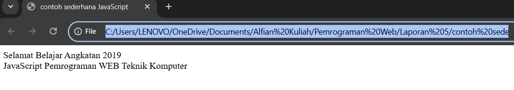

Memasukan data
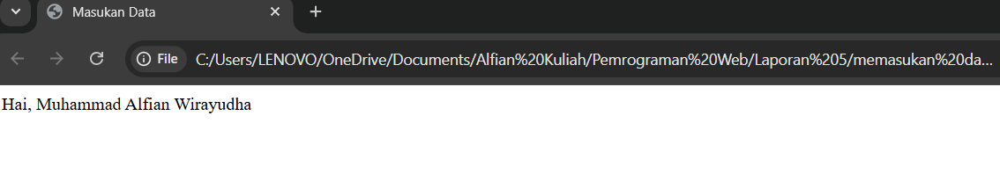

Jendela peringatan dan konfirmasi contoh 1
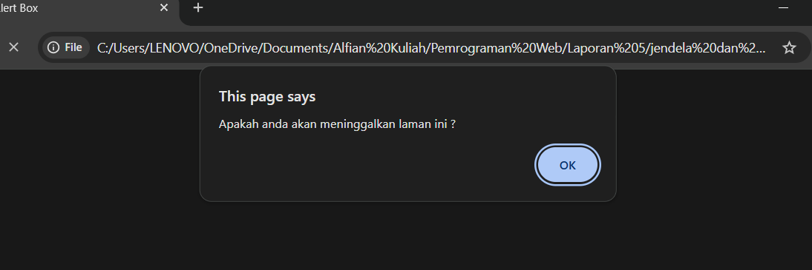

jendela peringatan dan konfirmasi contoh 2
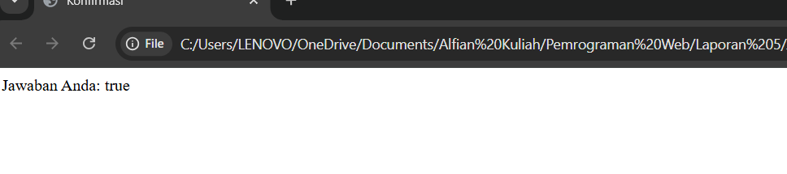
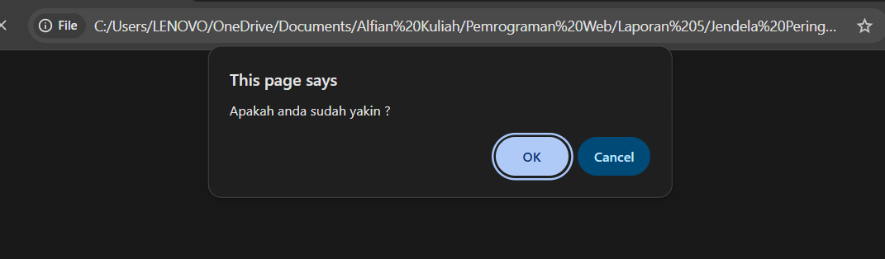

mendeklarasikan Variabel
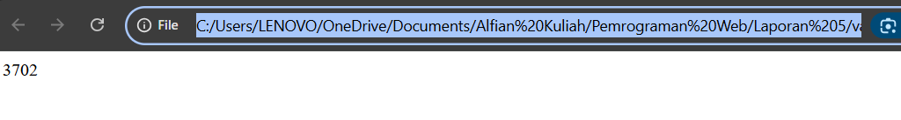

Global dan Lokal 1
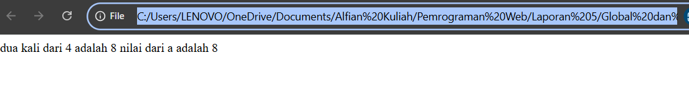 

Global dan lokal 2
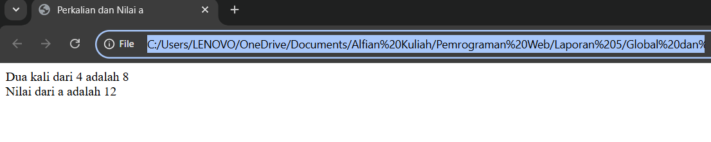

Konversi Tipe Data 
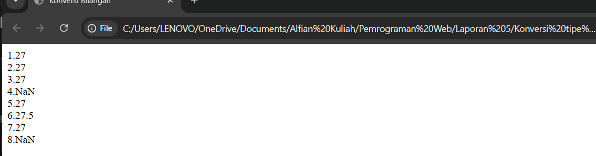

OperatorAritmatika 
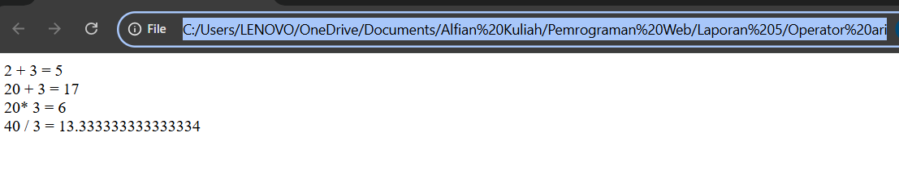

Operator Logika dan Pembanding 
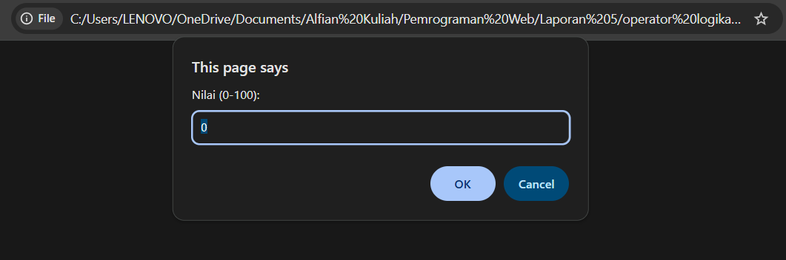
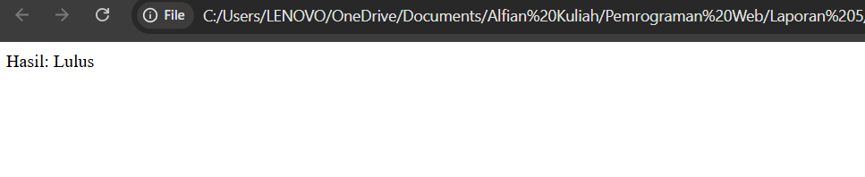
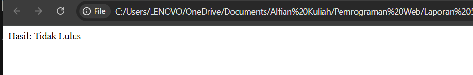
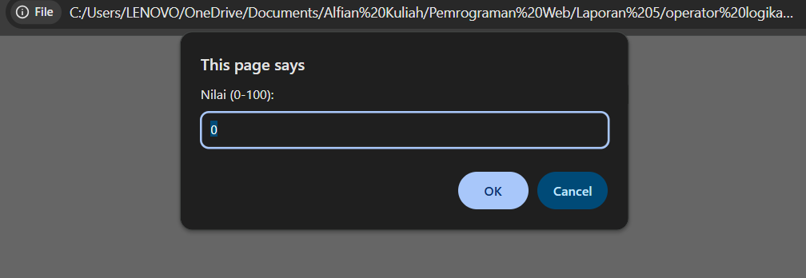

TUGAS MANDIRI

1.
import java.util.Scanner; 
= Untuk mengambil input dari pengguna melalui terminal/konsol.

public class TugasKonversiTipeData {
public static void main(String[] args) {
= TugasKonversiTipeData adalah nama kelas.
main adalah metode utama yang dijalankan saat program dieksekusi.

Scanner input = new Scanner(System.in);
=Digunakan untuk membaca input dari keyboard.

System.out.print("Masukkan sebuah teks: ");
String data = input.nextLine();
=Program meminta pengguna untuk memasukkan sebuah teks.
Teks disimpan dalam variabel data bertipe String.

try {
    int angka = Integer.parseInt(data);
    System.out.println("Ke Integer: " + angka + " | Tipe: int");
} catch (NumberFormatException e) {
    System.out.println("Tidak bisa dikonversi ke Integer");
}
= Menggunakan Integer.parseInt() untuk mencoba konversi ke int.
Jika data bukan angka bulat valid, maka NumberFormatException akan ditangkap, dan pesan kesalahan akan ditampilkan.


try {
    double angkaDouble = Double.parseDouble(data);
    System.out.println("Ke Double: " + angkaDouble + " | Tipe: double");
} catch (NumberFormatException e) {
    System.out.println("Tidak bisa dikonversi ke Double");
}
= sama seperti int, tapi menggunakan Double.parseDouble().
Menerima bilangan pecahan (desimal).

if (data.length() == 1) {
    char karakter = data.charAt(0);
    System.out.println("Ke Char: " + karakter + " | Tipe: char");
} else {
    System.out.println("Tidak bisa dikonversi ke Char (harus 1 karakter).");
}
= Menggunakan charAt(0) jika panjang data hanya 1 karakter.
Jika panjang lebih dari 1, dianggap tidak valid.

input.close(); 
= Menutup resource Scanner untuk mencegah memory leak.
}
}

2.

public class TugasArrayTipeData {
public static void main(String[] args) {

int[] angka = {10, 20, 30, 40, 50};
System.out.println("Array Integer:");
for (int i = 0; i < angka.length; i++) {
    System.out.println("angka[" + i + "] = " + angka[i]);
}
= 
Tipe data: int (bilangan bulat)
Ukuran: 5 elemen
Ditampilkan menggunakan loop for berdasarkan indeks.

double[] nilai = {3.14, 2.5, 7.8};
= Tipe data: double (bilangan pecahan/desimal)
Ukuran: 3 elemen
Ditampilkan dengan loop for

System.out.println("\nArray Double:");
for (int i = 0; i < nilai.length; i++) {
    System.out.println("nilai[" + i + "] = " + nilai[i]);
}
= Kode ini bertujuan untuk menampilkan isi array double[] nilai ke konsol, lengkap dengan indeks setiap elemennya.

char[] huruf = {'A', 'B', 'C', 'D'};
System.out.println("\nArray Char:");
for (int i = 0; i < huruf.length; i++) {
    System.out.println("huruf[" + i + "] = " + huruf[i]);
}
= Menampilkan isi array bertipe char (character) satu per satu dengan mencetak indeks dan nilai dari setiap elemen dalam array tersebut. Tipe: char
Isi array: 'A', 'B', 'C', 'D'

// Array tipe data boolean
boolean[] status = {true, false, true};
System.out.println("\nArray Boolean:");
for (int i = 0; i < status.length; i++) {
    System.out.println("status[" + i + "] = " + status[i]);
}
=

// Array tipe data String (objek)
String[] nama = {"Andi", "Budi", "Citra"};
System.out.println("\nArray String:");
for (int i = 0; i < nama.length; i++) {
    System.out.println("nama[" + i + "] = " + nama[i]); 
}
}
}
= Menampilkan isi array bertipe String, yaitu data teks/nama.
Menyertakan indeks untuk menunjukkan posisi setiap elemen dalam array
Tipe data: String[] → array dari objek String.
Isi array:
nama[0] = "Andi"
nama[1] = "Budi"
nama[2] = "Citra"

3.

<!DOCTYPE html>
= Menandakan dokumen ini menggunakan standar HTML5.

<html lang="en">
= Elemen root dokumen HTML dengan atribut bahasa Inggris (en).

<head>
= Bagian ini berisi metadata dokumen, seperti charset dan judul.

  <meta charset="UTF-8" />
  = Mengatur encoding karakter halaman menjadi UTF-8 agar mendukung karakter internasional (termasuk bahasa Indonesia).

  <title>Calculator Sederhana</title>
  = Judul halaman yang akan muncul di tab browser.

  <style>
    body {
      font-family: Arial, sans-serif;
      = Mengatur font utama halaman menggunakan Arial dan font cadangan sans-serif.

      max-width: 300px;
      = Membatasi lebar maksimal halaman hanya 300 piksel agar tampilannya kompak,

      margin: 40px auto;
      = Memberi jarak 40px dari atas dan bawah, dan auto secara horizontal untuk membuat body berada di tengah layar.

      padding: 20px;
     = Memberi ruang dalam agar konten tidak menempel di tepi.

      border: 2px solid #333;
      = Memberikan garis tepi tebal berwarna abu gelap di sekitar body.

      border-radius: 8px;
      = Membuat sudut border melengkung halus dengan radius 8px.
    }
    input[type="text"] {
      width: 100%;
      = Membuat input memenuhi lebar container body.

      font-size: 1.2em;
      = Membuat teks dalam input sedikit lebih besar dari default agar mudah dibaca.

      padding: 10px;
      = Memberi ruang dalam input agar teks tidak terlalu dekat dengan tepi.

      margin-bottom: 10px;
      = Memberi jarak di bawah input agar tidak terlalu mepet dengan tombol.

      box-sizing: border-box;
      = Mengatur supaya padding dan border dihitung dalam lebar elemen

      text-align: right;
      = Mengatur teks di input agar rata kanan, seperti layaknya tampilan kalkulator.
    }
    button {
      width: 22%;
      = Lebar tombol sekitar 22% dari container,

      font-size: 1.2em;
      = Membuat teks tombol lebih besar dan mudah dilihat.

      margin: 1%;
      = Memberi jarak antar tombol supaya tidak berdempetan.

      padding: 10px;
      = Memberi ruang dalam tombol agar ukuran klik cukup besar dan nyaman.

      cursor: pointer;
     = Mengubah kursor menjadi pointer saat hover, memberi tahu user tombol bisa diklik.
    }
  </style>
</head>
<body>

  <h2>Calculator Sederhana</h2>
  <input type="text" id="display" readonly />
  <br />
= Menampilkan judul "Calculator Sederhana" yang cukup jelas dan semantik.
Input ini digunakan sebagai layar kalkulator untuk menampilkan angka dan hasil perhitungan.

  <button onclick="appendNumber('7')">7</button>
  <button onclick="appendNumber('8')">8</button>
  <button onclick="appendNumber('9')">9</button>
  <button onclick="appendOperator('/')">÷</button>

  <button onclick="appendNumber('4')">4</button>
  <button onclick="appendNumber('5')">5</button>
  <button onclick="appendNumber('6')">6</button>
  <button onclick="appendOperator('*')">×</button>

  <button onclick="appendNumber('1')">1</button>
  <button onclick="appendNumber('2')">2</button>
  <button onclick="appendNumber('3')">3</button>
  <button onclick="appendOperator('-')">−</button>

  <button onclick="appendNumber('0')">0</button>
  <button onclick="appendNumber('.')">.</button>
  <button onclick="calculateResult()">=</button>
  <button onclick="appendOperator('+')">+</button>
= Ketika tombol angka diklik, fungsi appendNumber dipanggil dengan parameter angka yang ditekan (misal '7').
Isi tombol berupa angka itu sendiri, jadi tampilan tombol jelas dan sesuai fungsi.
Ketika tombol operator (+, -, *, /) diklik, fungsi appendOperator dipanggil dengan operator terkait sebagai parameter.
Tombol operator menampilkan simbol yang familiar (÷, ×, −, +) agar mudah dimengerti.

  <br />
  <button style="width: 96%" onclick="clearDisplay()">Clear</button>
= Tombol ini berfungsi untuk menghapus atau mengosongkan layar kalkulator.
style="width: 96%" membuat tombol memenuhi hampir seluruh lebar container, berbeda dengan tombol lain yang kecil, sehingga tombol ini mudah terlihat dan diakses.

  <script>
    const display = document.getElementById('display');
 = Mendapatkan elemen input layar kalkulator berdasarkan ID display agar bisa dimanipulasi di fungsi-fungsi selanjutnya.

    function appendNumber(number) {
      
      if(display.value === "0") {
        display.value = number;
      } else {
        display.value += number;
      }
    }
  = Fungsi ini bertugas menambahkan angka atau tanda desimal ke tampilan layar.
Logika:
Jika saat ini layar hanya berisi "0", maka akan diganti dengan angka yang baru dimasukkan (menghindari angka dengan banyak nol di depan).
Jika bukan "0", angka baru akan di-append (ditambahkan) ke akhir string di layar.

    function appendOperator(operator) {
      const lastChar = display.value.slice(-1);
      
      if (display.value !== "" && !"+-*/.".includes(lastChar)) {
        display.value += operator;
      }
    }
 = Fungsi untuk menambahkan operator (+, -, *, /) ke layar.
Logika:
Mengecek apakah layar tidak kosong (display.value !== "").
Mengecek karakter terakhir tidak termasuk operator atau tanda titik, supaya operator tidak berturut-turut (misal: ++ atau *.).

    function calculateResult() {
      try {
       
        const result = eval(display.value);
        display.value = result;
      } catch (e) {
        display.value = "Error";
      }
    }
= Fungsi untuk menghitung ekspresi matematika yang ada di layar menggunakan fungsi bawaan eval() JavaScript.
eval() mengevaluasi string sebagai kode JavaScript dan mengembalikan hasilnya.
Jika terjadi error (misalnya ekspresi salah format), akan ditampilkan "Error" pada layar.

    function clearDisplay() {
      display.value = "";
    }
  </script>
= Fungsi yang mengosongkan layar kalkulator dengan mengubah nilai display.value menjadi string kosong.

</body>
= Menutup elemen <body>

</html> 
= Menutup elemen <html>


4.

<!DOCTYPE html>
```
<html lang="en">
<head>
  <meta charset="UTF-8" />
  = Memberitahu browser bahwa dokumen HTML ini menggunakan encoding karakter UTF-8.

  <title>Hitungan Bangun Ruang</title>
  = memberikan nama dan judul halaman.

  <style>
    body {
      font-family: Arial, sans-serif;
      = Mengatur jenis huruf teks pada seluruh elemen dalam <body>.

      max-width: 400px;
      = Membatasi lebar maksimum elemen <body> agar tidak melebar lebih dari 400 piksel.

      margin: 30px auto;
      = Memberikan jarak vertikal 30px (atas dan bawah) di sekitar <body>.

      padding: 20px;
      = Memberikan ruang dalam sebesar 20px di sekeliling isi <body>, sehingga isi tidak menempel ke tepi elemen.

      border: 2px solid #333;
     = Membuat garis tepi solid dengan ketebalan 2px dan warna abu-abu tua (#333).

      border-radius: 8px;
      = Membulatkan sudut-sudut border dengan radius 8px,

      background-color: #f9f9f9;
    }
    = Mengatur warna latar belakang <body> menjadi abu-abu sangat muda

    h2 {
      text-align: center;
      = Mengatur teks pada elemen <h2> agar berada di tengah horizontal.
Ini membuat judul halaman terlihat simetris dan fokus.

    }
    button {
      display: block;
      = Membuat tombol menjadi elemen blok yang mengambil seluruh lebar kontainer induknya.

      width: 100%;
      = Tombol akan selebar 100% dari kontainer, membuatnya responsif dan mudah diklik.

      padding: 10px;
      = Memberikan ruang dalam agar teks tombol tidak menempel pada tepi, sehingga lebih nyaman dilihat dan di-klik.

      font-size: 1.1em;
      = Ukuran font sedikit lebih besar dari default, membuat tombol mudah dibaca.

      margin: 15px 0;
      = Memberikan jarak vertikal antara tombol dan elemen lain agar tidak terlalu rapat.

      cursor: pointer;
      = Mengubah cursor menjadi pointer saat hover di tombol,
    }
    .result {
      background-color: #fff;
      = Memberikan latar belakang putih pada area hasil,
     
      padding: 15px;
      = Memberi ruang dalam yang cukup agar isi hasil tidak menempel ke tepi.

      border-radius: 6px;
      = Membulatkan sudut-sudut kontainer hasil, membuat tampilan lebih halus dan modern.

      border: 1px solid #ccc;
      = Memberi garis batas tipis berwarna abu-abu muda, memberikan efek kotak terdefinisi.

      font-size: 1.1em;
      = Ukuran font cukup besar agar hasil mudah dibaca.

      line-height: 1.6;
      = Memberikan jarak antar baris teks agar hasil tidak terlihat padat.
    }
  </style>
</head>
<body>

  <h2>Hitungan Bangun Ruang</h2>
  = Judul halaman yang berisi "Hitungan Bangun Ruang"

  <button onclick="hitungBangunRuang()">Hitung Bangun Ruang</button>
 = Sebuah tombol yang ketika diklik akan memicu fungsi JavaScript

  <div id="output" class="result"></div>
= Sebuah elemen div dengan id output dan class result

  <script>
    function hitungBangunRuang() {
      const output = document.getElementById('output');
      = Mendapatkan elemen dengan id output agar bisa menampilkan hasil perhitungan.

     
      const sisiKubus = 5;
      = sisiKubus = 5 cm

      const volumeKubus = sisiKubus ** 3;
      = Volume kubus = sisi³ → 5³ = 125 cm³

      
      const panjangBalok = 10;
      const lebarBalok = 6;
      const tinggiBalok = 4;
      const volumeBalok = panjangBalok * lebarBalok * tinggiBalok;
    = Panjang = 10 cm, Lebar = 6 cm, Tinggi = 4 cm
    Volume balok = panjang × lebar × tinggi → 10 × 6 × 4 = 240 cm³
      
      const jariTabung = 7;
      const tinggiTabung = 10;
      const volumeTabung = Math.PI * (jariTabung ** 2) * tinggiTabung;
      = Jari-jari = 7 cm, Tinggi = 10 cm
      Rumus volume tabung = π × r² × t
     Math.PI adalah konstanta π di JavaScript
     Volume dihitung dan disimpan di volumeTabung

      output.innerHTML = `
        <strong>Volume Kubus</strong> (sisi 5 cm): ${volumeKubus} cm³<br/>
        <strong>Volume Balok</strong> (10 × 6 × 4 cm): ${volumeBalok} cm³<br/>
        <strong>Volume Tabung</strong> (r = 7 cm, t = 10 cm): ${volumeTabung.toFixed(2)} cm³
      `;
    }
    = Hasil ketiga perhitungan tersebut ditampilkan dalam format HTML dengan tag <strong> untuk menonjolkan nama bangun ruang.
   <br/> digunakan agar setiap hasil muncul di baris baru.

  </script>
= Menutup elemen <scripy>

</body>
= Menutup elemen <body>

</html>
=Menutup elemen <html>
```
OUTPUTNYA :
1. 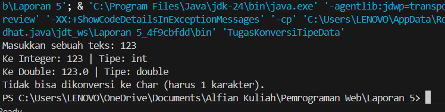

2. 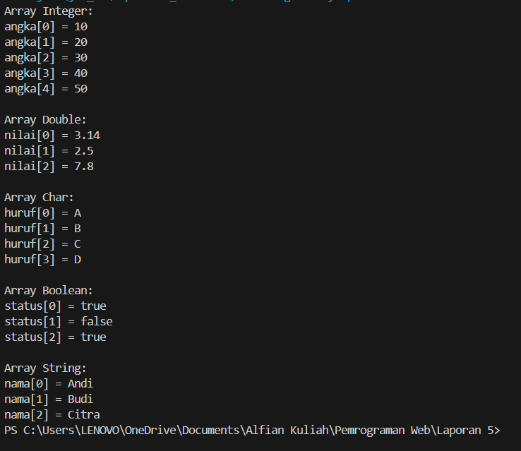

3. 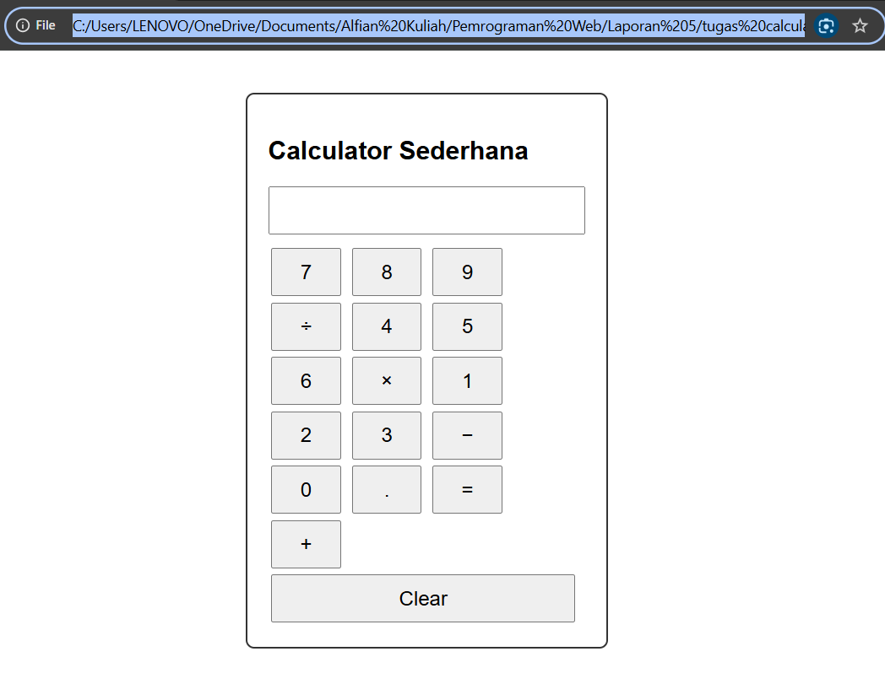

4. 